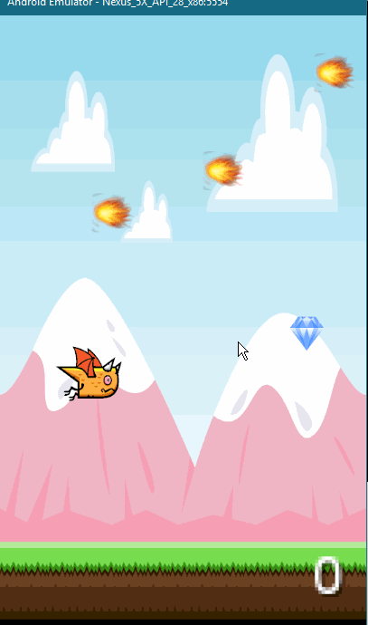

*Flappy Run*

**Flappy Run** is an android game inspired by flappy bird where users attempt to collect as nany coins as they can without getting hit by speeding projectiles

Submitted by: **Syed Sadman**

The following assets are added:

* [x] Fireballs and trees with increasing speeds after score is greater than 20
* [x] Introduce rockets once score is greater than 10
* [x] At a score of 30, rockets become much faster and game becomes much more difficult

## Notes
LibGDX game

## License

    Copyright [2019] [Syed Sadman]

    Licensed under the Apache License, Version 2.0 (the "License");
    you may not use this file except in compliance with the License.
    You may obtain a copy of the License at

        http://www.apache.org/licenses/LICENSE-2.0

    Unless required by applicable law or agreed to in writing, software
    distributed under the License is distributed on an "AS IS" BASIS,
    WITHOUT WARRANTIES OR CONDITIONS OF ANY KIND, either express or implied.
    See the License for the specific language governing permissions and
    limitations under the License.
